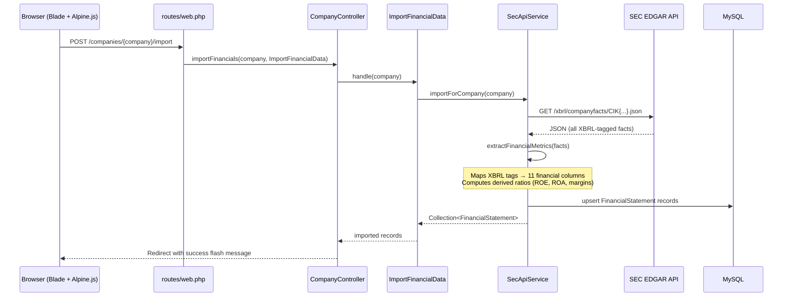
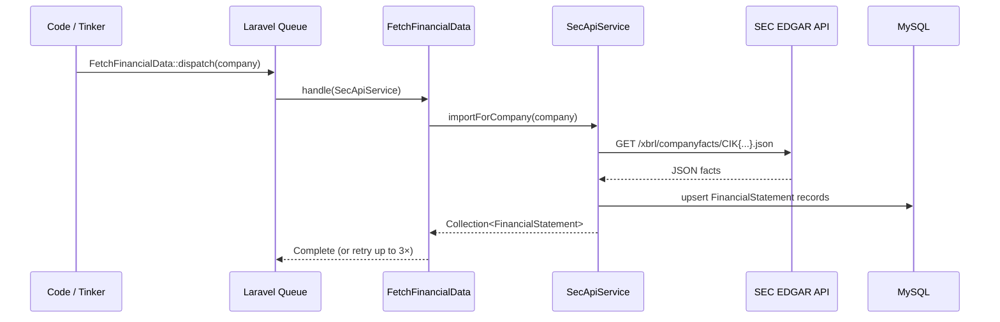
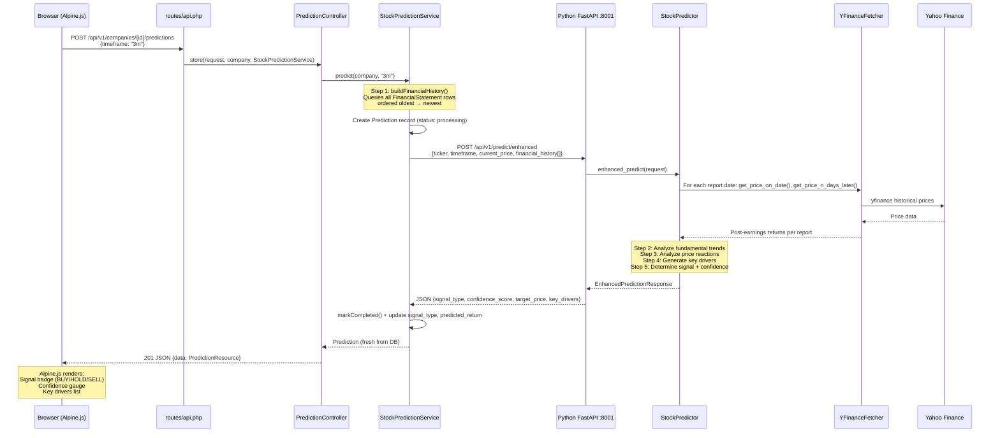
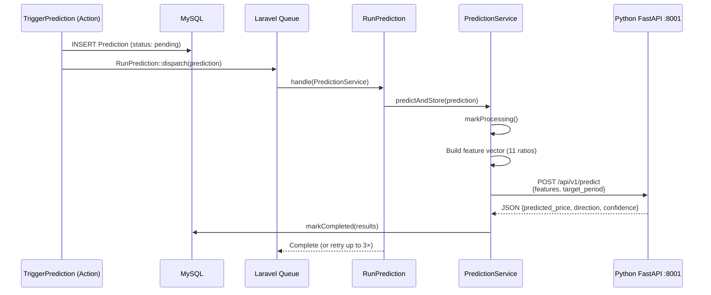
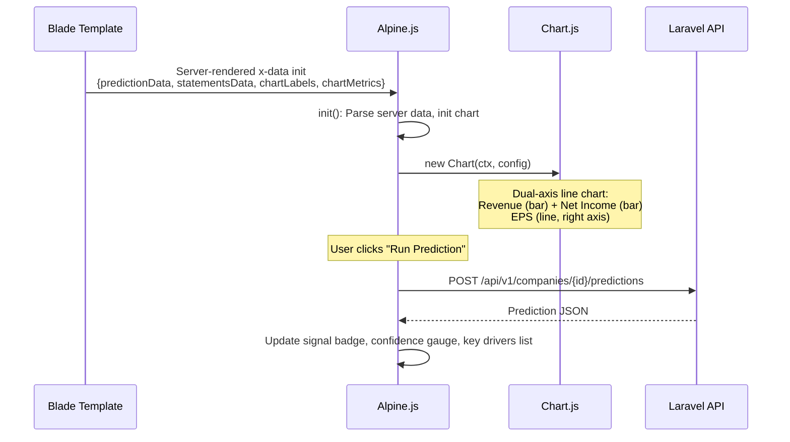

# StockPrediction — AI-Powered Stock Market Prediction Dashboard

A full-stack application that combines **SEC EDGAR financial data**, **Yahoo Finance market data**, and **machine learning** to predict stock price movements and generate trading signals (BUY / HOLD / SELL).

---

## Table of Contents

1. [What This Project Aims to Achieve](#what-this-project-aims-to-achieve)
2. [Architecture Overview](#architecture-overview)
3. [Flow Process — How the Files Connect](#flow-process--how-the-files-connect)
4. [How the AI Model Works](#how-the-ai-model-works)
5. [Project Structure](#project-structure)
6. [Setup & Installation](#setup--installation)
7. [Code Walkthrough (Learning Guide)](#code-walkthrough-learning-guide)
8. [API Reference](#api-reference)
9. [Database Schema](#database-schema)

---

## What This Project Aims to Achieve

### The Problem

Investors spend hours manually reviewing SEC filings (10-K, 10-Q) and historical price data to decide whether to buy, hold, or sell a stock. This is time-consuming, inconsistent, and hard to quantify.

### The Solution

StockPrediction automates this end-to-end:

```
SEC EDGAR API ──→ Extract financial metrics ──→ Feature vector (11 ratios)
                                                          │
Yahoo Finance ──→ Price history + market data ────────────┤
                                                          │
                                                  ┌───────▼──────┐
                                                  │  AI Ensemble │
                                                  │ XGBoost + RF │
                                                  └───────┬──────┘
                                                          │
                                  Signal: BUY / HOLD / SELL
                                  + Confidence Score (%)
                                  + Key Drivers (ranked factors)
```

### Features

- **One-click SEC Import** — Pull 10-K/10-Q financials from SEC EDGAR XBRL API
- **AI Predictions** — XGBoost + RandomForest ensemble on fundamental ratios + technical indicators
- **Post-Earnings Analysis** — For each historical report, fetches the actual price reaction via Yahoo Finance
- **Trading Signals** — Returns buy/hold/sell with confidence score and ranked key drivers
- **Interactive Dashboard** — Dark-themed UI with real-time Alpine.js reactivity + Chart.js

---

## Architecture Overview

```
┌──────────────────────────────────────────────────────────────────────┐
│                    BROWSER (Alpine.js + Tailwind CSS)                 │
│  ┌─────────────────────┐    ┌──────────────────────────────────────┐ │
│  │ Import SEC Data Btn  │    │ Run Prediction + Timeframe Select     │ │
│  └─────────┬───────────┘    └─────────────────┬────────────────────┘ │
│            │            AJAX (fetch API)       │                       │
└────────────┼──────────────────────────────────┼───────────────────────┘
             │                                   │
    ┌────────▼───────────────────────────────────▼────────┐
    │              LARAVEL 12 (PHP 8.2)                    │
    │  ┌──────────────────┐  ┌──────────────────────────┐ │
    │  │ SecApiService    │  │ StockPredictionService    │ │
    │  │ (SEC EDGAR XBRL) │  │ (Enhanced AI prediction)  │ │
    │  └────────┬─────────┘  └───────────┬──────────────┘ │
    └───────────┼─────────────────────────┼─────────────────┘
                │                         │
    ┌───────────▼─────────┐   ┌───────────▼──────────────────┐
    │  SEC EDGAR API       │   │  Python FastAPI (Port 8001)  │
    │  data.sec.gov        │   │  ┌────────────────────────┐ │
    └──────────────────────┘   │  │ StockPredictor          │ │
                               │  │ (XGBoost + RandomForest)│ │
                               │  └────────────────────────┘ │
                               │  ┌────────────────────────┐ │
                               │  │ YFinanceFetcher         │ │
                               │  │ (yfinance wrapper)      │ │
                               │  └───────────┬────────────┘ │
                               └──────────────┼──────────────┘
                                              │
                                    ┌─────────▼─────────┐
                                    │  Yahoo Finance     │
                                    └───────────────────┘
```

### Tech Stack

| Layer | Technology |
|---|---|
| Frontend | Blade templates, Alpine.js 3, Tailwind CSS CDN, Chart.js 4 |
| Backend | Laravel 12, PHP 8.2 |
| ML Service | Python 3.11, FastAPI, scikit-learn, XGBoost, yfinance |
| Database | MySQL 8 |
| Data Sources | SEC EDGAR (XBRL), Yahoo Finance (via yfinance) |

---

## Flow Process — How the Files Connect

This section traces the exact file-by-file execution path for the two primary workflows: **importing SEC financial data** and **running an AI prediction**.

---

### Flow 1: SEC Financial Data Import

This flow pulls 10-K and 10-Q filings from the SEC EDGAR XBRL API and stores them as `FinancialStatement` records. There are two paths: **synchronous** (web form submit → page redirect) and **async** (queued job).

#### Path A: Synchronous (Web UI)



**File chain:**

| Step | File | Role |
|------|------|------|
| 1 | `routes/web.php` | Routes `POST /companies/{company}/import` → `CompanyController@importFinancials` |
| 2 | `app/Http/Controllers/CompanyController.php` | `importFinancials()` — resolves `ImportFinancialData` action, calls `$importer->handle($company)` |
| 3 | `app/Actions/ImportFinancialData.php` | Orchestrator — calls `SecApiService::importForCompany()`, logs progress |
| 4 | `app/Services/SecApiService.php` | `importForCompany()` → `fetchCompanyFacts()` → `extractFinancialMetrics()` → `computeDerivedRatios()` → upserts `FinancialStatement` rows |

#### Path B: Async (Queued Job)



**File chain:**

| Step | File | Role |
|------|------|------|
| 1 | `app/Jobs/FetchFinancialData.php` | Queued job — wraps `SecApiService::importForCompany()`, 3 retries, auto-deletes if company is removed |

---

### Flow 2: AI Prediction (Enhanced Mode — Primary)

This is the main "Run Prediction" button flow. The user selects a timeframe, the frontend sends an AJAX request, Laravel builds the full financial history payload, sends it to the Python FastAPI microservice, and the AI returns a trading signal. This is **synchronous** (request/response) so the UI updates immediately.



**File chain:**

| Step | File | Role |
|------|------|------|
| 1 | `resources/views/companies/show.blade.php` | Alpine.js `fetch()` sends AJAX POST with timeframe |
| 2 | `routes/api.php` | Routes `POST /api/v1/companies/{company}/predictions` → `PredictionController@store` |
| 3 | `app/Http/Controllers/PredictionController.php` | `store()` — validates request, calls `StockPredictionService::predict()` |
| 4 | `app/Services/StockPredictionService.php` | `predict()` — builds `buildFinancialHistory()` payload, HTTP POST to Python, maps response to `Prediction` columns |
| 5 | `ml_service/main.py` | FastAPI app — routes `POST /api/v1/predict/enhanced` → `predictor.enhanced_predict()` |
| 6 | `ml_service/models/predictor.py` | `StockPredictor.enhanced_predict()` — the core AI logic (trend analysis, price reactions, signal generation) |
| 7 | `ml_service/services/data_fetcher.py` | `YFinanceFetcher` — wraps `yfinance` to fetch historical prices and post-earnings returns |
| 8 | `ml_service/schemas/prediction.py` | Pydantic models — `EnhancedPredictionRequest`, `EnhancedPredictionResponse`, `FinancialRecord`, `KeyDriver` |
| 9 | `app/Http/Resources/PredictionResource.php` | API resource — shapes the JSON response returned to the frontend |
| 10 | `app/Models/Prediction.php` | Eloquent model — `markCompleted()`, `markFailed()`, `isActionable()`, casts for JSON columns |

---

### Flow 3: AI Prediction (Legacy Queue Mode)

An alternative prediction path using Laravel's queue system. Used when predictions should be processed asynchronously.



**File chain:**

| Step | File | Role |
|------|------|------|
| 1 | `routes/web.php` | Routes `POST /companies/{company}/predict` → `CompanyController@triggerPrediction` |
| 2 | `app/Http/Controllers/CompanyController.php` | `triggerPrediction()` — resolves `TriggerPrediction` action |
| 3 | `app/Actions/TriggerPrediction.php` | Creates `Prediction` record (status: pending), dispatches `RunPrediction` job |
| 4 | `app/Jobs/RunPrediction.php` | Queued job — calls `PredictionService::predictAndStore()`, 3 retries |
| 5 | `app/Services/PredictionService.php` | `predictAndStore()` — builds 11-ratio feature vector, calls Python `/api/v1/predict`, `markCompleted()` |

---

### Flow 4: Company CRUD & Watchlist

Supporting flows for managing companies and user watchlists.

```mermaid
graph TD
    A[Browser: Add Company Form] --> B[POST /companies]
    B --> C[CompanyController@store]
    C --> D[StoreCompanyRequest validates]
    D --> E[Company::create]
    E --> F[(companies table)]
    E --> G[Redirect to company show page]

    H[Browser: Company Listing] --> I[GET /companies]
    I --> J[CompanyController@index]
    J --> K[Query with sector/search filters]
    K --> L[Paginate 25 per page]
    L --> M[View: companies/index.blade.php]

    N[API: Watchlist] --> O[GET/POST/DELETE /api/v1/watchlist]
    O --> P[auth:sanctum middleware]
    P --> Q[WatchlistController]
    Q --> R[(user_watchlists table)]
```

**File chain:**

| Step | File | Role |
|------|------|------|
| 1 | `app/Http/Requests/StoreCompanyRequest.php` | Validates `ticker`, `name`, `sector`, `cik` |
| 2 | `app/Http/Controllers/CompanyController.php` | `index()`, `show()`, `store()` — Blade views + API JSON |
| 3 | `app/Http/Controllers/WatchlistController.php` | Authenticated watchlist CRUD |
| 4 | `app/Models/Company.php` | `hasMany` financialStatements, predictions, watchlist; `latestPrediction()`, `latestFinancialStatement()` |
| 5 | `app/Models/UserWatchlist.php` | Belongs to user + company |
| 6 | `app/Http/Resources/CompanyResource.php` | Shapes company JSON for API responses |

---

### Flow 5: Frontend Rendering (Alpine.js Dashboard)

How the Blade template initializes and updates the UI.



**File chain:**

| Step | File | Role |
|------|------|------|
| 1 | `resources/views/layouts/app.blade.php` | Dark theme layout (zinc-950), Tailwind CDN, Alpine.js CDN, Chart.js CDN |
| 2 | `resources/views/companies/show.blade.php` | Main dashboard — Alpine.js component with `x-data`, prediction panel, financial table, chart |
| 3 | `resources/views/companies/index.blade.php` | Company listing with sector filter, search, pagination |

---

### Complete System Architecture (File-Level)

```
┌─────────────────────────────────────────────────────────────────────────┐
│                           BROWSER                                        │
│  resources/views/                                                        │
│  ├── layouts/app.blade.php          (dark theme shell)                   │
│  └── companies/                                                          │
│      ├── index.blade.php            (company listing + search)           │
│      └── show.blade.php             (Alpine.js dashboard + Chart.js)     │
└────────────────────────────────┬────────────────────────────────────────┘
                                 │ AJAX (fetch)
                                 ▼
┌─────────────────────────────────────────────────────────────────────────┐
│                       LARAVEL 12 ROUTING                                 │
│  routes/web.php                   (6 Blade routes)                       │
│  routes/api.php                   (10 JSON API routes)                   │
└────────────────────────────────┬────────────────────────────────────────┘
                                 │
                    ┌────────────┴────────────┐
                    ▼                         ▼
┌──────────────────────────────┐ ┌──────────────────────────────────────┐
│      IMPORT FLOW             │ │         PREDICTION FLOW               │
│                              │ │                                       │
│ CompanyController            │ │ PredictionController                 │
│   ├── index()                │ │   ├── index()                        │
│   ├── show()                 │ │   ├── show()                         │
│   ├── store()                │ │   └── store()  ← "Run Prediction"    │
│   ├── importFinancials()     │ │                                       │
│   └── triggerPrediction()    │ │        ↓                              │
│                              │ │ StockPredictionService                │
│        ↓                     │ │   ├── predict()                      │
│ ImportFinancialData (Action) │ │   ├── buildFinancialHistory()        │
│        ↓                     │ │   └── markCompleted()                │
│ SecApiService                │ │                                       │
│   ├── fetchCompanyFacts()    │ │        ↓                              │
│   ├── extractFinancialMetrics│ │ TriggerPrediction (Action)            │
│   ├── computeDerivedRatios() │ │        ↓                              │
│   └── importForCompany()     │ │ PredictionService (legacy)            │
│                              │ │   ├── predict()                      │
│        ↓ (async)             │ │   └── predictAndStore()              │
│ FetchFinancialData (Job)     │ │                                       │
│                              │ │        ↓ (async)                      │
│                              │ │ RunPrediction (Job)                   │
└──────────────────┬───────────┘ └────────────────┬─────────────────────┘
                   │                                │
                   │ HTTP                            │ HTTP
                   ▼                                ▼
┌──────────────────────────────┐ ┌──────────────────────────────────────┐
│      SEC EDGAR API           │ │     Python FastAPI (Port 8001)        │
│      data.sec.gov            │ │                                      │
│                              │ │ main.py (7 endpoints)                 │
│                              │ │   ├── GET  /health                   │
│                              │ │   ├── POST /api/v1/predict            │
│                              │ │   ├── POST /api/v1/predict/enhanced   │
│                              │ │   ├── POST /api/v1/predict/from-ticker│
│                              │ │   ├── POST /api/v1/train              │
│                              │ │   ├── POST /api/v1/data/stock-info    │
│                              │ │   └── POST /api/v1/data/historical    │
│                              │ │                                      │
│                              │ │ models/predictor.py                   │
│                              │ │   └── StockPredictor                  │
│                              │ │       ├── enhanced_predict()          │
│                              │ │       ├── predict_from_features()     │
│                              │ │       └── train()                     │
│                              │ │                                      │
│                              │ │ services/data_fetcher.py              │
│                              │ │   └── YFinanceFetcher (yfinance)      │
│                              │ │                                      │
│                              │ │ schemas/prediction.py                 │
│                              │ │   └── Pydantic request/response models│
└──────────────────────────────┘ └──────────────────┬───────────────────┘
                                                    │ yfinance
                                                    ▼
                                         ┌──────────────────────┐
                                         │    Yahoo Finance      │
                                         └──────────────────────┘
```

---

## How the AI Model Works

### Three Prediction Modes

The Python ML service supports three distinct prediction approaches:

---

#### Mode 1: Fundamental Analysis (Heuristic)

**Endpoint:** `POST /api/v1/predict`

**Input:** 11 financial ratios:

| Feature | What it measures | Weight |
|---|---|---|
| `eps` | Earnings per share | +0.7 (strongest positive) |
| `roe` | Return on equity | +0.6 |
| `roa` | Return on assets | +0.5 |
| `free_cash_flow` | Operating cash minus capex | +0.5 |
| `gross_margin` | Gross profit / revenue | +0.4 |
| `operating_margin` | Operating income / revenue | +0.4 |
| `revenue_growth` | YoY revenue growth % | +0.35 |
| `current_ratio` | Current assets / current liabilities | +0.3 |
| `market_cap` | Total market value | +0.001 |
| `pe_ratio` | Price-to-earnings | -0.5 (high P/E = overvalued) |
| `debt_to_equity` | Total debt / equity | -0.4 (high debt = risky) |

**How it works:**

```python
score = 100.0  # base price in dollars
for feature, weight in weights.items():
    score += float(features[feature]) * weight
predicted_price = max(score, 1.0)
```

Confidence = 0.3 + (features_provided / 11) × 0.7, capped at 0.95.
Direction = bullish if predicted > current × 1.05, bearish if < current × 0.95.

---

#### Mode 2: Enhanced Prediction (with Post-Earnings Analysis)

**Endpoint:** `POST /api/v1/predict/enhanced`

This is the **primary** prediction flow — called when the user clicks "Run Prediction."

**Input:** The company's **entire financial statement history** (e.g., 69 records for AAPL) + current price.

**5-Step Pipeline:**

```
Step 1: Enrich with yfinance price reactions
┌─────────────────────────────────────────────────────────┐
│ For each 10-K/10-Q report date:                          │
│  · Fetch stock price on report date                      │
│  · Fetch stock price N trading days later                │
│  · Compute % return (post-earnings drift)                │
│                                                          │
│ Example: AAPL 2020 10-K, price on report: $75            │
│          Price 63 days later: $62.50                     │
│          Post-earnings return: -16.7%                    │
└─────────────────────────────────────────────────────────┘

Step 2: Analyze fundamental trends across reports
┌─────────────────────────────────────────────────────────┐
│ EPS trend:  $3.05 → $5.67  (+86%)  → POSITIVE           │
│ ROE trend:  15.1% → 150.1%  (↑)    → POSITIVE           │
│ Margin trend: Check if expanding/contracting              │
│ D/E trend:   Check if rising (negative) or falling       │
└─────────────────────────────────────────────────────────┘

Step 3: Analyze historical price reactions
┌─────────────────────────────────────────────────────────┐
│ Average post-report return across all reports:           │
│  +2.3% avg → POSITIVE historical signal                 │
│  -5.1% avg → NEGATIVE historical signal                 │
└─────────────────────────────────────────────────────────┘

Step 4: Generate key drivers (ranked)
┌─────────────────────────────────────────────────────────┐
│ 1. EPS Growth (positive) — strong earnings trend         │
│ 2. ROE Improvement (positive) — efficiency gains         │
│ 3. Margin Expansion (positive) — pricing power           │
│ 4. Rising Leverage (negative) — more debt than before    │
│ 5. Post-Earnings History — avg return +2.3%              │
└─────────────────────────────────────────────────────────┘

Step 5: Determine signal and confidence
┌─────────────────────────────────────────────────────────┐
│ net_score = positive_drivers - negative_drivers          │
│                                                          │
│ net_score ≥ +2  →  BUY                                  │
│ net_score ≤ -2  →  SELL                                 │
│ otherwise       →  HOLD                                 │
│                                                          │
│ Confidence = 0.4 + (total_drivers / 10), max 0.95       │
│ Predicted return = avg_historical_return ± 2%            │
└─────────────────────────────────────────────────────────┘
```

---

#### Mode 3: Technical / Price-Forecast (ML Ensemble)

**Endpoint:** `POST /api/v1/train`

Trains the XGBoost + RandomForest ensemble on a ticker's price history.

**Pipeline:**

```
1. Fetch OHLCV data from yfinance (e.g., 5 years daily)
2. Engineer technical features:
   · returns_5d, returns_20d  (price returns)
   · volatility_20d            (rolling std dev)
   · volume_ratio              (current vs 20d avg volume)
   · sma_20, sma_50            (simple moving averages)
   · price_to_sma20            (price relative to 20d SMA)
3. Create target: closing price N days in the future
4. Chronological train/test split (no shuffle — time series!)
5. Scale features with StandardScaler
6. Train XGBoost (100 trees, depth 6) + RandomForest (100 trees, depth 8)
7. Ensemble = average of both models
8. Evaluate: MAE, RMSE, R² on test set
```

---

## Project Structure

```
project-stock-prediction/
├── app/
│   ├── Actions/
│   │   ├── ImportFinancialData.php      # Wraps SecApiService
│   │   └── TriggerPrediction.php        # Creates Prediction + dispatches job
│   ├── Http/
│   │   ├── Controllers/
│   │   │   ├── CompanyController.php     # CRUD, import, predict (web + API)
│   │   │   ├── PredictionController.php  # Run predictions, list results
│   │   │   └── WatchlistController.php   # User watchlist (auth:sanctum)
│   │   ├── Requests/
│   │   │   ├── StoreCompanyRequest.php
│   │   │   └── TriggerPredictionRequest.php
│   │   └── Resources/
│   │       ├── CompanyResource.php
│   │       └── PredictionResource.php
│   ├── Jobs/
│   │   ├── FetchFinancialData.php       # Async SEC import
│   │   └── RunPrediction.php            # Async ML prediction
│   ├── Models/
│   │   ├── Company.php                  # ticker, name, sector, cik, market_cap
│   │   ├── FinancialStatement.php       # 11 ratios + raw financials
│   │   ├── Prediction.php               # signal, confidence, key_drivers
│   │   └── UserWatchlist.php
│   └── Services/
│       ├── SecApiService.php            # SEC EDGAR XBRL API client
│       ├── PredictionService.php        # ML service (fundamental mode)
│       └── StockPredictionService.php   # AI service (enhanced mode)
│
├── ml_service/                          # Python FastAPI ML microservice
│   ├── main.py                          # 7 endpoints on port 8001
│   ├── requirements.txt                 # Python dependencies
│   ├── models/predictor.py              # StockPredictor (XGBoost + RF)
│   ├── schemas/prediction.py            # Pydantic request/response models
│   └── services/data_fetcher.py         # YFinanceFetcher (yfinance)
│
├── database/
│   ├── migrations/                      # 8 migration files
│   ├── factories/                       # Model factories for testing
│   └── seeders/DatabaseSeeder.php       # 26 real companies + test user
│
├── resources/views/
│   ├── layouts/app.blade.php            # Dark theme (zinc-950) layout
│   └── companies/
│       ├── index.blade.php              # Company listing + search + filter
│       └── show.blade.php               # Alpine.js prediction dashboard
│
├── routes/
│   ├── web.php                          # 6 web routes (Blade views)
│   └── api.php                          # 10 API routes (JSON)
│
├── config/services.php                  # ML + AI + SEC config
└── bootstrap/app.php                    # JSON errors for API routes
```

---

## Setup & Installation

### Prerequisites

- PHP 8.2+, Composer
- Python 3.11+, pip
- MySQL 8
- XAMPP (or any Apache/MySQL stack)

### Quick Start

```bash
# 1. PHP dependencies
cd project-stock-prediction
composer install
cp .env.example .env
php artisan key:generate

# 2. Configure .env database
# DB_CONNECTION=mysql
# DB_DATABASE=stock_prediction

# 3. Migrations + seed
php artisan migrate
php artisan db:seed        # Creates 26 real companies (AAPL, MSFT, TSLA, etc.)

# 4. Python ML dependencies
cd ml_service
pip install -r requirements.txt

# 5. Start Python ML service (keep this terminal open)
python main.py
# → http://0.0.0.0:8001

# 6. Open in browser (XAMPP)
# → http://localhost/project-stock-prediction/public/companies
```

---

## Code Walkthrough (Learning Guide)

### Part 1: Data Models

**`Company`** (`app/Models/Company.php`) — A publicly traded company. Key field: `cik` (SEC Central Index Key) — without this, SEC data can't be fetched. Has `latestFinancialStatement()` and `latestPrediction()` helpers.

**`FinancialStatement`** (`app/Models/FinancialStatement.php`) — One row = one SEC filing. Stores both raw dollar amounts (revenue, net_income) and computed ratios (gross_margin, roe). The `gross_margin`, `operating_margin`, `roe`, and `roa` columns store **ratios** (0.00–1.00), not raw dollars. The `SecApiService` computes these from SEC raw data.

**`Prediction`** (`app/Models/Prediction.php`) — Stores AI prediction results. Lifecycle: `pending → processing → completed/failed`. Key columns: `signal_type` (buy/hold/sell), `predicted_return` (%), `confidence_score` (0–1), `feature_importance` (JSON array of drivers).

### Part 2: Fetching Financial Data

**`SecApiService`** (`app/Services/SecApiService.php`) — Bridge between SEC EDGAR and your database.

1. `fetchCompanyFacts($cik)` — GETs `data.sec.gov/api/xbrl/companyfacts/CIK{10-digit}.json`
2. `extractFinancialMetrics($facts)` — Maps SEC XBRL tags to database columns. Only keeps 10-K and 10-Q filings, deduplicates by `{year}_{quarter}_{form}`.
3. `computeDerivedRatios($metric)` — Converts raw SEC values to ratios:
   - `gross_margin = GrossProfit ÷ Revenue`
   - `operating_margin = OperatingIncome ÷ Revenue`
   - `roe = NetIncome ÷ (Assets - Liabilities)`
   - `roa = NetIncome ÷ Assets`
4. `importForCompany($company)` — Orchestrates the full flow: fetch → extract → compute → `updateOrCreate`.

### Part 3: Running Predictions

**`StockPredictionService`** (`app/Services/StockPredictionService.php`) — Enhanced prediction client.

1. `buildFinancialHistory($company)` — Queries ALL financial statements (oldest first), formats each into an array.
2. Sends to Python `POST /api/v1/predict/enhanced` with `{ticker, timeframe, current_price, financial_history: [...]}`.
3. Receives `{signal_type, predicted_return, confidence_score, key_drivers}`.
4. Maps: `signal_type → prediction_direction`, `key_drivers → feature_importance`, stores as `Prediction`.

### Part 4: Python ML Service

**`ml_service/main.py`** — FastAPI app with 7 endpoints. The enhanced prediction endpoint (`/api/v1/predict/enhanced`) does:

1. For each report date → `yfinance.get_price_reaction()` → price before/after
2. Compute fundamental trends (EPS, ROE, margins, leverage)
3. Determine signal = f(net driver score, avg historical return)
4. Return `{signal_type, predicted_return, confidence_score, key_drivers}`

**`ml_service/models/predictor.py`** — `StockPredictor` class:
- `predict()` — Fundamental mode: weighted heuristic on 11 ratios
- `train_on_price_history()` — Technical mode: trains XGBoost + RandomForest on OHLCV-derived features with chronological split (no shuffle for time series)
- Ensemble = average of both models

**`ml_service/services/data_fetcher.py`** — `YFinanceFetcher` wraps yfinance:
- `get_price_reaction(ticker, date, days)` — Price on report date + N days later
- `get_training_data(ticker)` — Builds supervised DataFrame with technical features
- `get_stock_info(ticker)` — Structured metadata (sector, market cap, PE, etc.)

### Part 5: Frontend (Alpine.js)

**`resources/views/companies/show.blade.php`** — The prediction dashboard:

- **Inline `x-data` component** (not a function call) to avoid HTML attribute `"` conflicts from JSON data
- `importSecData()` — fetch → spinner → refresh table → toast
- `runPrediction()` — fetch → "Running AI Model..." → swap empty state → signal card
- UI states: empty ("No actionable prediction") ↔ results (signal badge, return %, drivers chart)
- `Js::from()` used for embedding PHP data in `x-data` attribute (handles `"` escaping)

---

## API Reference

### Laravel API (JSON)

| Method | URL | Auth | Description |
|---|---|---|---|
| `GET` | `/api/v1/companies` | — | List companies (?sector=, ?search=) |
| `GET` | `/api/v1/companies/{id}` | — | Show company + financials + predictions |
| `POST` | `/api/v1/companies` | — | Create company |
| `POST` | `/api/v1/companies/{id}/import` | — | Import SEC financial data |
| `GET` | `/api/v1/companies/{id}/predictions` | — | List predictions |
| `POST` | `/api/v1/companies/{id}/predictions` | — | **Run prediction** `{timeframe:"3m"}` |
| `GET` | `/api/v1/predictions/{id}` | — | Show single prediction |
| `GET/POST/DELETE` | `/api/v1/watchlist` | Sanctum | User watchlist |

### Python ML API (Port 8001)

| Method | URL | Body | Response |
|---|---|---|---|
| `GET` | `/health` | — | `{status, model_loaded}` |
| `POST` | `/api/v1/predict` | `{features:{...}, target_period}` | `{predicted_price, confidence, direction}` |
| `POST` | `/api/v1/predict/enhanced` | `{ticker, timeframe, current_price, financial_history}` | `{signal_type, predicted_return, confidence, key_drivers}` |
| `POST` | `/api/v1/data/stock-info` | `{ticker}` | `{name, sector, market_cap, pe, eps, beta}` |
| `POST` | `/api/v1/data/historical` | `{ticker, period, interval}` | `{data: [{date,open,high,low,close,volume}]}` |
| `POST` | `/api/v1/train` | `{ticker, period, target_days_ahead}` | `{metrics: {mae, rmse, r2}}` |

---

## Database Schema

### `companies`
| Column | Type | Notes |
|---|---|---|
| `ticker` | varchar(10) UNIQUE | e.g. AAPL |
| `name` | varchar(255) | Apple Inc. |
| `sector` | varchar(100) | Technology, Healthcare... |
| `cik` | varchar(20) | SEC Central Index Key |
| `market_cap` | unsignedBigInt | In USD |
| `latest_price` | decimal(15,4) | Current stock price |

### `financial_statements`
| Column | Type | Notes |
|---|---|---|
| `company_id` | FK → companies | |
| `fiscal_year` | year | e.g. 2021 |
| `fiscal_quarter` | tinyint | 0=annual, 1-4=Q1-Q4 |
| `filing_type` | enum('10-K','10-Q') | |
| `revenue` | decimal(20,2) | Total revenue |
| `eps` | decimal(12,4) | Earnings per share |
| `gross_margin` | decimal(8,4) | Ratio 0.00–1.00 |
| `operating_margin` | decimal(8,4) | Ratio 0.00–1.00 |
| `roe` | decimal(8,4) | Return on equity |
| `roa` | decimal(8,4) | Return on assets |
| Unique: `(company_id, fiscal_year, fiscal_quarter, filing_type)` | | |

### `predictions`
| Column | Type | Notes |
|---|---|---|
| `company_id` | FK → companies | |
| `financial_statement_id` | FK → financial_statements | |
| `signal_type` | varchar(10) | buy/hold/sell |
| `predicted_return` | decimal(8,6) | e.g. 0.052 = +5.2% |
| `confidence_score` | decimal(?,4) | 0.0–1.0 |
| `prediction_direction` | varchar | bullish/bearish/neutral |
| `feature_importance` | JSON | `[{feature, importance, impact}]` |
| `status` | varchar | pending/processing/completed/failed |
