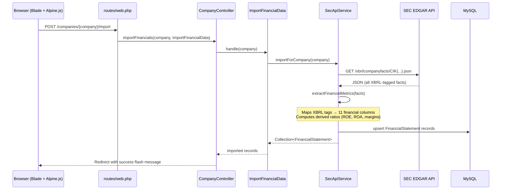
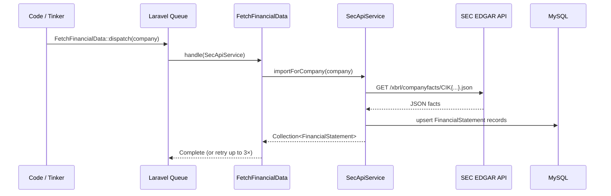
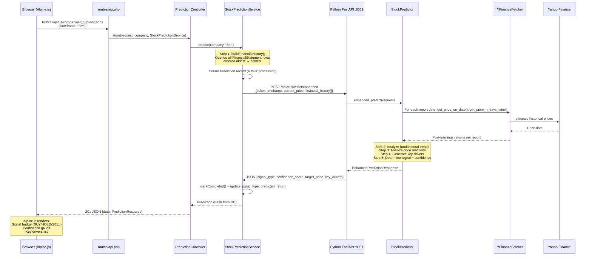
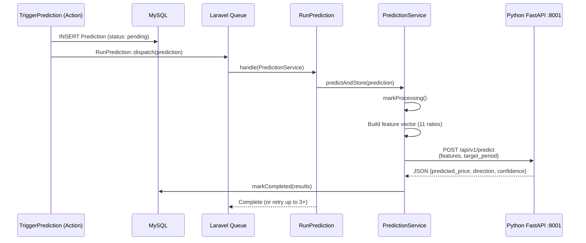
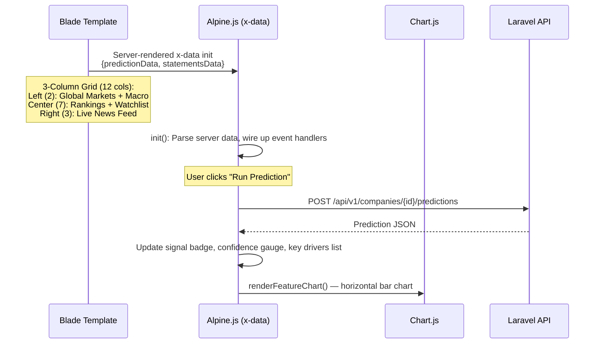

# StockPrediction — AI-Powered Stock Market Prediction Dashboard

A full-stack application that combines **SEC EDGAR financial data**, **Yahoo Finance market data**, and **machine learning** to predict stock price movements and generate trading signals (BUY / HOLD / SELL).

---

## Table of Contents

1. [What This Project Aims to Achieve](#what-this-project-aims-to-achieve)
2. [Architecture Overview](#architecture-overview)
3. [Flow Process — How the Files Connect](#flow-process--how-the-files-connect)
4. [How the AI Model Works](#how-the-ai-model-works)
5. [Project Structure](#project-structure)
6. [Setup & Installation](#setup--installation)
7. [Code Walkthrough (Learning Guide)](#code-walkthrough-learning-guide)
8. [UI Design System — Noir & Cyber-Monochrome](#ui-design-system--noir--cyber-monochrome)
9. [Production Deployment](#production-deployment)
10. [API Reference](#api-reference)
11. [Database Schema](#database-schema)

---

## What This Project Aims to Achieve

### The Problem

Investors spend hours manually reviewing SEC filings (10-K, 10-Q) and historical price data to decide whether to buy, hold, or sell a stock. This is time-consuming, inconsistent, and hard to quantify.

### The Solution

StockPrediction automates this end-to-end:

```
SEC EDGAR API ──→ Extract financial metrics ──→ Feature vector (11 ratios)
                                                          │
Yahoo Finance ──→ Price history + market data ────────────┤
                                                          │
                                                  ┌───────▼──────┐
                                                  │  AI Ensemble │
                                                  │ XGBoost + RF │
                                                  └───────┬──────┘
                                                          │
                                  Signal: BUY / HOLD / SELL
                                  + Confidence Score (%)
                                  + Key Drivers (ranked factors)
```

### Features

- **Bloomberg Terminal Dashboard** — Full-width 3-column layout with Global Markets, Watchlist, and Live News Feed
- **Noir & Cyber-Monochrome Theme** — Pure black (`#000000`) backgrounds, vermilion-orange accent (`#ff3b00`), neon emerald buy signals (`#00e676`), crimson sell signals (`#ff1744`)
- **One-click SEC Import** — Pull 10-K/10-Q financials from SEC EDGAR XBRL API
- **AI Predictions** — XGBoost + RandomForest ensemble on fundamental ratios + technical indicators
- **Post-Earnings Analysis** — For each historical report, fetches the actual price reaction via Yahoo Finance
- **Technical Price Alignment** — Compares fundamental direction with daily/weekly OHLC candle momentum for confidence bonuses/penalties
- **Trading Signals** — Returns buy/hold/sell with confidence score, breakdown, and ranked key drivers
- **Live Rankings** — Sortable table of all companies by prediction strength
- **Interactive Charts** — Chart.js revenue trends + Alpine.js real-time prediction updates
- **Production-Ready ML Service** — Windows Service / Task Scheduler launchers for persistent background operation

---

## Architecture Overview

```
┌──────────────────────────────────────────────────────────────────────┐
│              BROWSER (Alpine.js + Tailwind CSS CDN + Chart.js)       │
│  ┌───────────────────┐  ┌──────────────────────────────────────────┐ │
│  │ Import SEC Data    │  │ Run Prediction + Timeframe Select         │ │
│  └─────────┬─────────┘  └─────────────────┬────────────────────────┘ │
│            │          AJAX (fetch API)     │                          │
└────────────┼──────────────────────────────┼──────────────────────────┘
             │                                   │
    ┌────────▼───────────────────────────────────▼────────┐
    │              LARAVEL 12 (PHP 8.2)                    │
    │  ┌──────────────────┐  ┌──────────────────────────┐ │
    │  │ SecApiService    │  │ StockPredictionService    │ │
    │  │ (SEC EDGAR XBRL) │  │ (Enhanced AI prediction)  │ │
    │  └────────┬─────────┘  └───────────┬──────────────┘ │
    └───────────┼─────────────────────────┼─────────────────┘
                │                         │
    ┌───────────▼─────────┐   ┌───────────▼──────────────────┐
    │  SEC EDGAR API       │   │  Python FastAPI (Port 8001)  │
    │  data.sec.gov        │   │  ┌────────────────────────┐ │
    └──────────────────────┘   │  │ StockPredictor          │ │
                               │  │ (XGBoost + RandomForest)│ │
                               │  └────────────────────────┘ │
                               │  ┌────────────────────────┐ │
                               │  │ YFinanceFetcher         │ │
                               │  │ (yfinance wrapper)      │ │
                               │  └───────────┬────────────┘ │
                               └──────────────┼──────────────┘
                                              │
                                    ┌─────────▼─────────┐
                                    │  Yahoo Finance     │
                                    └───────────────────┘
```

### Tech Stack

| Layer | Technology |
|---|---|
| Frontend | Blade templates, Alpine.js 3, Tailwind CSS CDN (custom `noir`/`accent`/`buy`/`sell`/`mute` palette), Chart.js 4 |
| Backend | Laravel 12, PHP 8.2 |
| ML Service | Python 3.11, FastAPI 0.115+, scikit-learn 1.5+, XGBoost 2.1+, yfinance 0.2+ |
| Database | MySQL 8 |
| Data Sources | SEC EDGAR (XBRL), Yahoo Finance (via yfinance) |

---

## Flow Process — How the Files Connect

This section traces the exact file-by-file execution path for the two primary workflows: **importing SEC financial data** and **running an AI prediction**.

---

### Flow 1: SEC Financial Data Import

This flow pulls 10-K and 10-Q filings from the SEC EDGAR XBRL API and stores them as `FinancialStatement` records. There are two paths: **synchronous** (web form submit → page redirect) and **async** (queued job).

#### Path A: Synchronous (Web UI)



**File chain:**

| Step | File | Role |
|------|------|------|
| 1 | `routes/web.php` | Routes `POST /companies/{company}/import` → `CompanyController@importFinancials` |
| 2 | `app/Http/Controllers/CompanyController.php` | `importFinancials()` — resolves `ImportFinancialData` action, calls `$importer->handle($company)` |
| 3 | `app/Actions/ImportFinancialData.php` | Orchestrator — calls `SecApiService::importForCompany()`, logs progress |
| 4 | `app/Services/SecApiService.php` | `importForCompany()` → `fetchCompanyFacts()` → `extractFinancialMetrics()` → `computeDerivedRatios()` → upserts `FinancialStatement` rows |

#### Path B: Async (Queued Job)



**File chain:**

| Step | File | Role |
|------|------|------|
| 1 | `app/Jobs/FetchFinancialData.php` | Queued job — wraps `SecApiService::importForCompany()`, 3 retries, auto-deletes if company is removed |

---

### Flow 2: AI Prediction (Enhanced Mode — Primary)

This is the main "Run Prediction" button flow. The user selects a timeframe, the frontend sends an AJAX request, Laravel builds the full financial history payload, sends it to the Python FastAPI microservice, and the AI returns a trading signal. This is **synchronous** (request/response) so the UI updates immediately.



**File chain:**

| Step | File | Role |
|------|------|------|
| 1 | `resources/views/companies/show.blade.php` | Alpine.js `fetch()` sends AJAX POST with timeframe |
| 2 | `routes/api.php` | Routes `POST /api/v1/companies/{company}/predictions` → `PredictionController@store` |
| 3 | `app/Http/Controllers/PredictionController.php` | `store()` — validates request, calls `StockPredictionService::predict()` |
| 4 | `app/Services/StockPredictionService.php` | `predict()` — builds `buildFinancialHistory()` payload, HTTP POST to Python, maps response to `Prediction` columns |
| 5 | `ml_service/main.py` | FastAPI app — routes `POST /api/v1/predict/enhanced` → `predictor.enhanced_predict()` |
| 6 | `ml_service/models/predictor.py` | `StockPredictor.enhanced_predict()` — the core AI logic (trend analysis, price reactions, signal generation) |
| 7 | `ml_service/services/data_fetcher.py` | `YFinanceFetcher` — wraps `yfinance` to fetch historical prices and post-earnings returns |
| 8 | `ml_service/schemas/prediction.py` | Pydantic models — `EnhancedPredictionRequest`, `EnhancedPredictionResponse`, `FinancialRecord`, `KeyDriver` |
| 9 | `app/Http/Resources/PredictionResource.php` | API resource — shapes the JSON response returned to the frontend |
| 10 | `app/Models/Prediction.php` | Eloquent model — `markCompleted()`, `markFailed()`, `isActionable()`, casts for JSON columns |

---

### Flow 3: AI Prediction (Legacy Queue Mode)

An alternative prediction path using Laravel's queue system. Used when predictions should be processed asynchronously.



**File chain:**

| Step | File | Role |
|------|------|------|
| 1 | `routes/web.php` | Routes `POST /companies/{company}/predict` → `CompanyController@triggerPrediction` |
| 2 | `app/Http/Controllers/CompanyController.php` | `triggerPrediction()` — resolves `TriggerPrediction` action |
| 3 | `app/Actions/TriggerPrediction.php` | Creates `Prediction` record (status: pending), dispatches `RunPrediction` job |
| 4 | `app/Jobs/RunPrediction.php` | Queued job — calls `PredictionService::predictAndStore()`, 3 retries |
| 5 | `app/Services/PredictionService.php` | `predictAndStore()` — builds 11-ratio feature vector, calls Python `/api/v1/predict`, `markCompleted()` |

---

### Flow 4: Company CRUD & Watchlist

Supporting flows for managing companies and user watchlists.

```mermaid
graph TD
    A[Browser: Add Company Form] --> B[POST /companies]
    B --> C[CompanyController@store]
    C --> D[StoreCompanyRequest validates]
    D --> E[Company::create]
    E --> F[(companies table)]
    E --> G[Redirect to company show page]

    H[Browser: Company Listing] --> I[GET /companies]
    I --> J[CompanyController@index]
    J --> K[Query with sector/search filters]
    K --> L[Paginate 25 per page]
    L --> M[View: companies/index.blade.php]

    N[API: Watchlist] --> O[GET/POST/DELETE /api/v1/watchlist]
    O --> P[auth:sanctum middleware]
    P --> Q[WatchlistController]
    Q --> R[(user_watchlists table)]
```

**File chain:**

| Step | File | Role |
|------|------|------|
| 1 | `app/Http/Requests/StoreCompanyRequest.php` | Validates `ticker`, `name`, `sector`, `cik` |
| 2 | `app/Http/Controllers/CompanyController.php` | `index()`, `show()`, `store()` — Blade views + API JSON |
| 3 | `app/Http/Controllers/WatchlistController.php` | Authenticated watchlist CRUD |
| 4 | `app/Models/Company.php` | `hasMany` financialStatements, predictions, watchlist; `latestPrediction()`, `latestFinancialStatement()` |
| 5 | `app/Models/UserWatchlist.php` | Belongs to user + company |
| 6 | `app/Http/Resources/CompanyResource.php` | Shapes company JSON for API responses |

---

### Flow 5: Frontend Rendering (Bloomberg Terminal Dashboard)

The dashboard uses a **3-column Bloomberg Terminal layout** with full viewport width. Alpine.js handles real-time prediction updates, Chart.js renders revenue/income trends, and Tailwind CSS CDN provides the Noir & Cyber-Monochrome styling.



**File chain:**

| Step | File | Role |
|------|------|------|
| 1 | `resources/views/layouts/app.blade.php` | Full-width noir layout, custom Tailwind palette (`noir`, `accent`, `buy`, `sell`, `mute`), live clock, Rankings nav link |
| 2 | `resources/views/companies/index.blade.php` | **Bloomberg Terminal 3-column dashboard** — Global Markets (left), Watchlist + Rankings (center), Live News Feed (right) |
| 3 | `resources/views/companies/show.blade.php` | Company detail — prediction panel, financial statements table, revenue/income Chart.js, confidence breakdown accordion |
| 4 | `resources/views/companies/rankings.blade.php` | Full ranking table with sortable signals, confidence bars, legend badges |

---

### Complete System Architecture (File-Level)

```
┌─────────────────────────────────────────────────────────────────────────┐
│                           BROWSER                                        │
│  resources/views/                                                        │
│  ├── layouts/app.blade.php          (full-width noir terminal shell)     │
│  └── companies/                                                          │
│      ├── index.blade.php            (3-col Bloomberg dashboard)          │
│      ├── show.blade.php             (Alpine.js prediction + Chart.js)    │
│      └── rankings.blade.php         (sortable prediction strength table) │
└────────────────────────────────┬────────────────────────────────────────┘
                                 │ AJAX (fetch)
                                 ▼
┌─────────────────────────────────────────────────────────────────────────┐
│                       LARAVEL 12 ROUTING                                 │
│  routes/web.php                   (7 Blade routes)                       │
│  routes/api.php                   (10 JSON API routes)                   │
└────────────────────────────────┬────────────────────────────────────────┘
                                 │
                    ┌────────────┴────────────┐
                    ▼                         ▼
┌──────────────────────────────┐ ┌──────────────────────────────────────┐
│      IMPORT FLOW             │ │         PREDICTION FLOW               │
│                              │ │                                       │
│ CompanyController            │ │ PredictionController                 │
│   ├── index()                │ │   ├── index()                        │
│   ├── show()                 │ │   ├── show()                         │
│   ├── store()                │ │   └── store()  ← "Run Prediction"    │
│   ├── importFinancials()     │ │                                       │
│   └── triggerPrediction()    │ │        ↓                              │
│                              │ │ StockPredictionService                │
│        ↓                     │ │   ├── predict()                      │
│ ImportFinancialData (Action) │ │   ├── buildFinancialHistory()        │
│        ↓                     │ │   └── markCompleted()                │
│ SecApiService                │ │                                       │
│   ├── fetchCompanyFacts()    │ │        ↓                              │
│   ├── extractFinancialMetrics│ │ TriggerPrediction (Action)            │
│   ├── computeDerivedRatios() │ │        ↓                              │
│   └── importForCompany()     │ │ PredictionService (legacy)            │
│                              │ │   ├── predict()                      │
│        ↓ (async)             │ │   └── predictAndStore()              │
│ FetchFinancialData (Job)     │ │                                       │
│                              │ │        ↓ (async)                      │
│                              │ │ RunPrediction (Job)                   │
└──────────────────┬───────────┘ └────────────────┬─────────────────────┘
                   │                                │
                   │ HTTP                            │ HTTP
                   ▼                                ▼
┌──────────────────────────────┐ ┌──────────────────────────────────────┐
│      SEC EDGAR API           │ │     Python FastAPI (Port 8001)        │
│      data.sec.gov            │ │                                      │
│                              │ │ main.py (7 endpoints)                 │
│                              │ │   ├── GET  /health                   │
│                              │ │   ├── POST /api/v1/predict            │
│                              │ │   ├── POST /api/v1/predict/enhanced   │
│                              │ │   ├── POST /api/v1/predict/from-ticker│
│                              │ │   ├── POST /api/v1/train              │
│                              │ │   ├── POST /api/v1/data/stock-info    │
│                              │ │   └── POST /api/v1/data/historical    │
│                              │ │                                      │
│                              │ │ models/predictor.py                   │
│                              │ │   └── StockPredictor                  │
│                              │ │       ├── enhanced_predict()          │
│                              │ │       ├── predict_from_features()     │
│                              │ │       └── train()                     │
│                              │ │                                      │
│                              │ │ services/data_fetcher.py              │
│                              │ │   └── YFinanceFetcher (yfinance)      │
│                              │ │                                      │
│                              │ │ schemas/prediction.py                 │
│                              │ │   └── Pydantic request/response models│
└──────────────────────────────┘ └──────────────────┬───────────────────┘
                                                    │ yfinance
                                                    ▼
                                         ┌──────────────────────┐
                                         │    Yahoo Finance      │
                                         └──────────────────────┘
```

---

## How the AI Model Works

### What Are XGBoost and RandomForest?

| Model | What It Is | How It Works |
|-------|-----------|--------------|
| **XGBoost** (eXtreme Gradient Boosting) | A gradient-boosted decision tree algorithm | Builds trees **sequentially** — each new tree focuses on correcting the prediction errors of the previous trees. It uses gradient descent to minimize loss (error) at each step. XGBoost is known for speed and winning Kaggle competitions. |
| **RandomForest** | An ensemble of many independent decision trees | Builds hundreds of trees **in parallel**, each trained on a random subset of data rows and features (bagging). The final prediction is the **average** of all trees. This reduces overfitting and variance. |

**Why use both?** They complement each other. XGBoost is strong at capturing complex nonlinear patterns (sequential boosting). RandomForest is stable and resistant to overfitting (parallel bagging). Averaging them together — called **ensemble averaging** — gives a more robust prediction than either alone.

### Where Are They Actually Used?

The ML ensemble is used in **one specific workflow**: price forecasting via the `/api/v1/train` endpoint.

```
POST /api/v1/train
────────────────────────────────────────────────────────────────
 1. Fetch 5 years of AAPL daily OHLCV data from Yahoo Finance
 2. Engineer 12 technical features (moving averages, volatility, returns...)
 3. Target = closing price 60 trading days in the future
 4. Split: 80% training, 20% testing (chronological — no shuffle!)
 5. Scale features with StandardScaler
 6. Fit XGBoost (100 trees, depth 6)  ─┐
 7. Fit RandomForest (100 trees, depth 8) ─┤  ← THE ML TRAINING
 8. Evaluate: MAE, RMSE, R² on test set
                                            │
 9. predict_price(): ensemble = (XGBoost + RandomForest) / 2.0
```

**Model hyperparameters** (in `ml_service/models/predictor.py`):

```python
self.xgb_model = xgb.XGBRegressor(
    n_estimators=100,      # 100 boosting rounds
    max_depth=6,           # trees can go 6 levels deep
    learning_rate=0.1,     # step size per boosting round
    random_state=42,       # reproducible results
)

self.rf_model = RandomForestRegressor(
    n_estimators=100,      # 100 decision trees
    max_depth=8,           # each tree up to 8 levels deep
    random_state=42,       # reproducible results
)
```

### What the Main Dashboard ("Run Prediction") Actually Uses

This is important — the **"Run Prediction" button on the dashboard does NOT use XGBoost or RandomForest**. Instead, it uses the **Enhanced Fundamental Analysis** mode (`POST /api/v1/predict/enhanced`):

```
"Run Prediction" Button (show.blade.php)
─────────────────────────────────────────────
  ↓ POST /api/v1/predict/enhanced
  ↓
6 Trend Checks (rule-based heuristic, NOT ML):
 ┌────────────────────────────────────────────────┐
 │ 1. EPS Trend      — growing or declining?       │
 │ 2. ROE Trajectory  — improving or deteriorating? │
 │ 3. Margin Direction — expanding or contracting?  │
 │ 4. Leverage Change  — debt rising or falling?    │
 │ 5. Post-Earnings History — past price reactions  │
 │ 6. Technical Alignment — OHLC candles vs fundamentals │
 └────────────────────────────────────────────────┘
  ↓
 net_score = positive_drivers - negative_drivers
  ↓
 net_score ≥ +2 → BUY   │  net_score ≤ -2 → SELL   │  otherwise → HOLD
 confidence = 40% base + (drivers × 10%), capped at 95%
```

**Why not use ML for "Run Prediction"?** Because the ML ensemble is trained on OHLCV **price patterns** (technical mode), not on fundamental→price relationships. Training a model that maps P/E ratios, ROE, margins, etc. directly to future prices requires labeled historical data where each fundamental snapshot is paired with the subsequent price outcome — that labeled dataset doesn't exist yet for this project. The 6-trend heuristic is **transparent and interpretable** — you can see exactly *why* the AI made its BUY/SELL decision, unlike a black-box neural network.

### Three Prediction Modes — Summary

| Mode | Endpoint | Uses ML? | Purpose |
|------|----------|----------|---------|
| **Fundamental (Heuristic)** | `/api/v1/predict` | ❌ No | Weighted sum of 11 financial ratios → price estimate |
| **Enhanced (Dashboard)** | `/api/v1/predict/enhanced` | ❌ No | 6 trend checks from financial history + technical alignment → BUY/SELL/HOLD |
| **Technical / Price-Forecast** | `/api/v1/train` + `predict_price()` | ✅ **XGBoost + RandomForest** | Train ensemble on OHLCV patterns → predict future close price |

---

### Mode 1 Details: Fundamental (Heuristic)

**Endpoint:** `POST /api/v1/predict`

**Input:** 11 financial ratios:

| Feature | What it measures | Weight |
|---|---|---|
| `eps` | Earnings per share | +0.7 (strongest positive) |
| `roe` | Return on equity | +0.6 |
| `roa` | Return on assets | +0.5 |
| `free_cash_flow` | Operating cash minus capex | +0.5 |
| `gross_margin` | Gross profit / revenue | +0.4 |
| `operating_margin` | Operating income / revenue | +0.4 |
| `revenue_growth` | YoY revenue growth % | +0.35 |
| `current_ratio` | Current assets / current liabilities | +0.3 |
| `market_cap` | Total market value | +0.001 |
| `pe_ratio` | Price-to-earnings | -0.5 (high P/E = overvalued) |
| `debt_to_equity` | Total debt / equity | -0.4 (high debt = risky) |

**How it works:**

```python
score = 100.0  # base price in dollars
for feature, weight in weights.items():
    score += float(features[feature]) * weight
predicted_price = max(score, 1.0)
```

Confidence = 0.3 + (features_provided / 11) × 0.7, capped at 0.95.
Direction = bullish if predicted > current × 1.05, bearish if < current × 0.95.

---

### Mode 2 Details: Enhanced Prediction (Dashboard)

**Endpoint:** `POST /api/v1/predict/enhanced`

This is the **primary** prediction flow — called when the user clicks "Run Prediction."

**Input:** The company's **entire financial statement history** (e.g., 69 records for AAPL) + current price.

**5-Step Pipeline:**

```
Step 1: Enrich with yfinance price reactions
┌─────────────────────────────────────────────────────────┐
│ For each 10-K/10-Q report date:                          │
│  · Fetch stock price on report date                      │
│  · Fetch stock price N trading days later                │
│  · Compute % return (post-earnings drift)                │
│                                                          │
│ Example: AAPL 2020 10-K, price on report: $75            │
│          Price 63 days later: $62.50                     │
│          Post-earnings return: -16.7%                    │
└─────────────────────────────────────────────────────────┘

Step 2: Analyze fundamental trends across reports
┌─────────────────────────────────────────────────────────┐
│ EPS trend:  $3.05 → $5.67  (+86%)  → POSITIVE           │
│ ROE trend:  15.1% → 150.1%  (↑)    → POSITIVE           │
│ Margin trend: Check if expanding/contracting              │
│ D/E trend:   Check if rising (negative) or falling       │
└─────────────────────────────────────────────────────────┘

Step 3: Analyze historical price reactions
┌─────────────────────────────────────────────────────────┐
│ Average post-report return across all reports:           │
│  +2.3% avg → POSITIVE historical signal                 │
│  -5.1% avg → NEGATIVE historical signal                 │
└─────────────────────────────────────────────────────────┘

Step 4: Generate key drivers (ranked)
┌─────────────────────────────────────────────────────────┐
│ 5 Fundamental Drivers from SEC EDGAR + Yahoo Finance:    │
│ 1. EPS Growth (positive) — strong earnings trend         │
│ 2. ROE Improvement (positive) — efficiency gains         │
│ 3. Margin Expansion (positive) — pricing power           │
│ 4. Rising Leverage (negative) — more debt than before    │
│ 5. Post-Earnings History — avg return ±X%                │
│                                                          │
│ +1 Technical Alignment Driver from local OHLC data:      │
│ 6. Technical Price Alignment — does daily/weekly         │
│    candle momentum confirm or contradict fundamentals?   │
│    Alignment → +10% confidence bonus                     │
│    Contradiction → −10% confidence penalty               │
└─────────────────────────────────────────────────────────┘

Step 5: Determine signal and confidence
┌─────────────────────────────────────────────────────────┐
│ net_score = positive_drivers - negative_drivers          │
│                                                          │
│ net_score ≥ +2  →  BUY                                  │
│ net_score ≤ -2  →  SELL                                 │
│ otherwise       →  HOLD                                 │
│                                                          │
│ Confidence = 0.4 + (total_drivers / 10), max 0.95       │
│ Predicted return = avg_historical_return ± 2%            │
└─────────────────────────────────────────────────────────┘
```

---

### Mode 3 Details: Technical / Price-Forecast (ML Ensemble) ✅ Uses XGBoost + RandomForest

**Endpoint:** `POST /api/v1/train`

Trains the XGBoost + RandomForest ensemble on a ticker's price history.

**Pipeline:**

```
POST /api/v1/train  {ticker: "AAPL", period: "5y", target_days_ahead: 60}
│
├─ main.py: train_model()
│
├─ YFinanceFetcher.get_training_data(ticker, period, target_days_ahead)
│   └─ Fetch 5 years of daily OHLCV from Yahoo Finance via yfinance
│   └─ Engineer 12 technical features (moving averages, volatility, returns)
│   └─ Create target: close price 60 days later
│
└─ StockPredictor.train_on_price_history(df, test_size=0.2)  ← THE ML HAPPENS HERE
    │
    ├─ Chronological split: 80% train, 20% test (no shuffle — time series!)
    ├─ StandardScaler: normalize all features to μ=0, σ=1
    │
    ├─ 🔵 XGBoost.fit(X_train, y_train)     ← 100 trees, depth 6, lr=0.1
    ├─ 🟢 RandomForest.fit(X_train, y_train) ← 100 trees, depth 8
    │
    ├─ xgb_preds  = XGBoost.predict(X_test)
    ├─ rf_preds   = RandomForest.predict(X_test)
    ├─ ensemble   = (xgb_preds + rf_preds) / 2.0  ← average both models
    │
    └─ Evaluate: MAE, RMSE, R² on test set → {"mae": 5.23, "rmse": 7.89, "r2": 0.85}
```

**Code location** (`ml_service/models/predictor.py`, lines 134–200):

```python
def train_on_price_history(self, df, test_size=0.2):
    X = df[feature_cols].values       # 12 technical features
    y = df["target_close"].values      # price 60 days ahead

    X_train, X_test, y_train, y_test = train_test_split(
        X, y, test_size=test_size, shuffle=False  # time-series order
    )

    X_train_scaled = self.scaler.fit_transform(X_train)
    X_test_scaled  = self.scaler.transform(X_test)

    self.xgb_model.fit(X_train_scaled, y_train)   # 🔵 Train XGBoost
    self.rf_model.fit(X_train_scaled, y_train)     # 🟢 Train RandomForest

    xgb_preds = self.xgb_model.predict(X_test_scaled)
    rf_preds  = self.rf_model.predict(X_test_scaled)
    ensemble_preds = (xgb_preds + rf_preds) / 2.0  # Average ensemble

    mae  = mean_absolute_error(y_test, ensemble_preds)
    rmse = sqrt(mean((y_test - ensemble_preds)^2))
    r2   = r2_score(y_test, ensemble_preds)

    return {"mae": mae, "rmse": rmse, "r2": r2}
```

---

## Project Structure

```
project-stock-prediction/
├── app/
│   ├── Actions/
│   │   ├── ImportFinancialData.php      # Wraps SecApiService
│   │   └── TriggerPrediction.php        # Creates Prediction + dispatches job
│   ├── Http/
│   │   ├── Controllers/
│   │   │   ├── CompanyController.php     # CRUD, import, predict (web + API)
│   │   │   ├── PredictionController.php  # Run predictions, list results
│   │   │   └── WatchlistController.php   # User watchlist (auth:sanctum)
│   │   ├── Requests/
│   │   │   ├── StoreCompanyRequest.php
│   │   │   └── TriggerPredictionRequest.php
│   │   └── Resources/
│   │       ├── CompanyResource.php
│   │       └── PredictionResource.php
│   ├── Jobs/
│   │   ├── FetchFinancialData.php       # Async SEC import
│   │   └── RunPrediction.php            # Async ML prediction
│   ├── Models/
│   │   ├── Company.php                  # ticker, name, sector, cik, market_cap
│   │   ├── FinancialStatement.php       # 11 ratios + raw financials
│   │   ├── Prediction.php               # signal, confidence, key_drivers
│   │   └── UserWatchlist.php
│   └── Services/
│       ├── SecApiService.php            # SEC EDGAR XBRL API client
│       ├── PredictionService.php        # ML service (fundamental mode)
│       └── StockPredictionService.php   # AI service (enhanced mode)
│
├── ml_service/                          # Python FastAPI ML microservice
│   ├── main.py                          # 7 endpoints on port 8001 (dev with reload)
│   ├── run_prod.py                      # Production launcher (no reload)
│   ├── requirements.txt                 # Python dependencies
│   ├── models/predictor.py              # StockPredictor (XGBoost + RF)
│   ├── schemas/prediction.py            # Pydantic request/response models
│   └── services/data_fetcher.py         # YFinanceFetcher (yfinance)
│
├── start_ml_service.bat                 # Windows batch launcher for demo deployment
├── start_ml_service.vbs                 # Silent background launcher (no console window)
│
├── database/
│   ├── migrations/                      # 8 migration files
│   ├── factories/                       # Model factories for testing
│   └── seeders/DatabaseSeeder.php       # 26 real companies + test user
│
├── resources/views/
│   ├── layouts/app.blade.php            # Full-width noir terminal layout + custom Tailwind palette
│   └── companies/
│       ├── index.blade.php              # Bloomberg Terminal 3-col dashboard
│       ├── show.blade.php               # Alpine.js prediction + financials + Chart.js
│       └── rankings.blade.php           # Full ranking table with signal badges
│
├── resources/css/
│   └── app.css                          # Noir scrollbar styling, dialog backdrop
│
├── routes/
│   ├── web.php                          # 6 web routes (Blade views)
│   └── api.php                          # 10 API routes (JSON)
│
├── config/services.php                  # ML + AI + SEC config
└── bootstrap/app.php                    # JSON errors for API routes
```

---

## Setup & Installation

### Prerequisites

- PHP 8.2+, Composer
- Python 3.11+, pip
- MySQL 8
- XAMPP (or any Apache/MySQL stack)

### Quick Start

```bash
# 1. PHP dependencies
cd project-stock-prediction
composer install
cp .env.example .env
php artisan key:generate

# 2. Configure .env database
# DB_CONNECTION=mysql
# DB_DATABASE=stock_prediction

# 3. Migrations + seed
php artisan migrate
php artisan db:seed        # Creates 26 real companies (AAPL, MSFT, TSLA, etc.)

# 4. Python ML dependencies
cd ml_service
pip install -r requirements.txt

# 5. Start Python ML service (keep this terminal open)
cd ml_service
python main.py
# → http://0.0.0.0:8001  (development mode with hot-reload)

# For production / demo deployment, use:
python run_prod.py
# Or double-click start_ml_service.vbs to run silently in background

# 6. Open in browser (XAMPP)
# → http://localhost/project-stock-prediction/public/companies
```

---

## Code Walkthrough (Learning Guide)

### Part 1: Data Models

**`Company`** (`app/Models/Company.php`) — A publicly traded company. Key field: `cik` (SEC Central Index Key) — without this, SEC data can't be fetched. Has `latestFinancialStatement()` and `latestPrediction()` helpers.

**`FinancialStatement`** (`app/Models/FinancialStatement.php`) — One row = one SEC filing. Stores both raw dollar amounts (revenue, net_income) and computed ratios (gross_margin, roe). The `gross_margin`, `operating_margin`, `roe`, and `roa` columns store **ratios** (0.00–1.00), not raw dollars. The `SecApiService` computes these from SEC raw data.

**`Prediction`** (`app/Models/Prediction.php`) — Stores AI prediction results. Lifecycle: `pending → processing → completed/failed`. Key columns: `signal_type` (buy/hold/sell), `predicted_return` (%), `confidence_score` (0–1), `feature_importance` (JSON array of drivers).

### Part 2: Fetching Financial Data

**`SecApiService`** (`app/Services/SecApiService.php`) — Bridge between SEC EDGAR and your database.

1. `fetchCompanyFacts($cik)` — GETs `data.sec.gov/api/xbrl/companyfacts/CIK{10-digit}.json`
2. `extractFinancialMetrics($facts)` — Maps SEC XBRL tags to database columns. Only keeps 10-K and 10-Q filings, deduplicates by `{year}_{quarter}_{form}`.
3. `computeDerivedRatios($metric)` — Converts raw SEC values to ratios:
   - `gross_margin = GrossProfit ÷ Revenue`
   - `operating_margin = OperatingIncome ÷ Revenue`
   - `roe = NetIncome ÷ (Assets - Liabilities)`
   - `roa = NetIncome ÷ Assets`
4. `importForCompany($company)` — Orchestrates the full flow: fetch → extract → compute → `updateOrCreate`.

### Part 3: Running Predictions

**`StockPredictionService`** (`app/Services/StockPredictionService.php`) — Enhanced prediction client.

1. `buildFinancialHistory($company)` — Queries ALL financial statements (oldest first), formats each into an array.
2. Sends to Python `POST /api/v1/predict/enhanced` with `{ticker, timeframe, current_price, financial_history: [...]}`.
3. Receives `{signal_type, predicted_return, confidence_score, key_drivers}`.
4. Maps: `signal_type → prediction_direction`, `key_drivers → feature_importance`, stores as `Prediction`.

### Part 4: Python ML Service

**`ml_service/main.py`** — FastAPI app with 7 endpoints. The enhanced prediction endpoint (`/api/v1/predict/enhanced`) does:

1. For each report date → `yfinance.get_price_reaction()` → price before/after
2. Compute fundamental trends (EPS, ROE, margins, leverage)
3. Determine signal = f(net driver score, avg historical return)
4. Return `{signal_type, predicted_return, confidence_score, key_drivers}`

**`ml_service/models/predictor.py`** — `StockPredictor` class:
- `predict()` — Fundamental mode: weighted heuristic on 11 ratios
- `train_on_price_history()` — Technical mode: trains XGBoost + RandomForest on OHLCV-derived features with chronological split (no shuffle for time series)
- Ensemble = average of both models

**`ml_service/services/data_fetcher.py`** — `YFinanceFetcher` wraps yfinance:
- `get_price_reaction(ticker, date, days)` — Price on report date + N days later
- `get_training_data(ticker)` — Builds supervised DataFrame with technical features
- `get_stock_info(ticker)` — Structured metadata (sector, market cap, PE, etc.)

### Part 5: Frontend (Bloomberg Terminal UI)

**`resources/views/layouts/app.blade.php`** — Full-width Noir & Cyber-Monochrome layout:
- Custom Tailwind CDN color palette: `noir` (blacks #000000→#333333), `accent` (vermilion #ff3b00), `buy` (neon emerald #00e676), `sell` (crimson #ff1744), `mute` (silver #a1a1aa)
- Slim 48px nav bar with live clock, Dashboard/Rankings links, pulsing LIVE indicator
- Full viewport width (`w-full px-4`) — zero dead horizontal margins
- Compact monospace flash messages

**`resources/views/companies/index.blade.php`** — Bloomberg Terminal 3-column dashboard:

```
┌──────────────┬──────────────────────────────┬──────────────┐
│  LEFT (2/12) │    CENTER (7/12)             │ RIGHT (3/12) │
│              │                              │              │
│ Global Mkts  │ Compact Header Bar           │ LIVE NEWS    │
│ ──────────── │ ├─ Search + Sector Filter    │ ──────────── │
│ XAUUSD 2.9K  │ └─ [+ Add] CTA (vermilion)   │ 14:22 [GEO]  │
│ CL=F   76.4  │                              │ China stim.. │
│ SPX   5,834  │ Strong Buy │ Strong Sell     │ ── Reuters   │
│ DXY  104.87  │ Rank 1-5   │ Rank 1-5        │              │
│ BTC   87.4K  │ compact    │ compact         │              │
│              │            │                 │              │
│ Macro Ind.   │ Company Cards (3-col grid)   │              │
│ ──────────── │ ┌────┐┌────┐┌────┐          │              │
│ Fed Rate     │ │AAPL││TSLA││MSFT│          │              │
│ CPI YoY      │ └────┘└────┘└────┘          │              │
└──────────────┴──────────────────────────────┴──────────────┘
```

Key design choices:
- `text-[10px]`/`text-[11px]` for terminal-level data density
- `font-mono` on all tickers, prices, percentages, timestamps
- Sharp `border-noir-400` panels (no rounded corners — terminal aesthetic)
- `h-[calc(100vh-5rem)]` fills viewport; each column independently scrollable
- Left panel: 8 live market instruments + 7 macro indicators with ▲/▼ trend badges
- Right panel: 15 mock news items with timestamp, category badge, impact tag, source
- Vermilion accent (`#ff3b00`) for primary CTA buttons and nav highlights
- Signal badges inline on company cards (BUY/SELL/HOLD)

**`resources/views/companies/rankings.blade.php`** — Full sortable ranking table:
- All companies ranked by prediction strength (BUY first, then HOLD, SELL, unpredicted)
- Color-coded confidence bars with percentage labels
- Summary stat cards (BUY/HOLD/SELL/No Data counts)

**`resources/views/companies/show.blade.php`** — The prediction dashboard:

- **Inline `x-data` component** (not a function call) to avoid HTML attribute `"` conflicts from JSON data
- `importSecData()` — fetch → spinner → refresh table → toast
- `runPrediction()` — fetch → "Running AI Model..." → swap empty state → signal card
- UI states: empty ("No actionable prediction") ↔ results (signal badge, return %, drivers chart)
- `Js::from()` used for embedding PHP data in `x-data` attribute (handles `"` escaping)
- Confidence Breakdown accordion — formula, score bars, driver scorecard, 6 trend checks, technical alignment panel
- Chart.js: `renderFeatureChart()` horizontal bar + revenue/income dual-line trend chart

---

## UI Design System — Noir & Cyber-Monochrome

The application uses a custom Tailwind CSS color palette designed for high-contrast, high-density financial terminal displays.

### Color Palette

| Token | Hex | Usage |
|-------|-----|-------|
| `noir-950` | `#000000` | Body background (pure black) |
| `noir-800` | `#0d0d0d` | Card / panel backgrounds |
| `noir-700` | `#121212` | Elevated surfaces |
| `noir-600` | `#1a1a1a` | Hover states, secondary surfaces |
| `noir-500` | `#1f1f1f` | Standard borders |
| `noir-400` | `#262626` | Strong borders, inputs |
| `accent` | `#ff3b00` | Primary CTAs, nav highlights, logo |
| `buy` | `#00e676` | Bullish signals, BUY badges, positive returns |
| `sell` | `#ff1744` | Bearish signals, SELL badges, negative returns |
| `mute` | `#a1a1aa` | Primary muted text |
| `mute-dim` | `#8e8e93` | Secondary muted text, placeholders |

### Typography

- **Font**: Inter (sans-serif) via bunny.net CDN
- **Sizes**: `text-[10px]` / `text-[11px]` for labels and indicators (terminal density), `text-xs` for content, `text-sm` for headings
- **Monospace**: `font-mono` applied to ticker symbols, prices, percentages, timestamps, form inputs
- **Tracking**: `tracking-[0.15em]` on uppercase section titles

### Border & Shape Convention

- No rounded corners (`rounded-none`) on all panels for authentic terminal feel
- `border border-noir-400` on all cards, panels, inputs, and tables
- `border-noir-500` for subtle internal dividers
- `hover:border-noir-300` for interactive card hover states

---

## Production Deployment

### ML Service Auto-Start

For demo/production deployments where the Python ML service must run persistently:

**Option 1 — Windows Startup Folder:**
1. Press `Win+R`, type `shell:startup`, Enter
2. Create shortcut to `start_ml_service.vbs`
3. Service starts silently on every boot

**Option 2 — Windows Task Scheduler:**
1. Open Task Scheduler → Create Basic Task
2. Name: `StockPrediction ML Service`
3. Trigger: At system startup
4. Action: Start program → browse to `start_ml_service.vbs`
5. Check "Run whether user is logged on or not"

**Option 3 — Manual background launch:**
```bash
# Production mode (no hot-reload):
python ml_service/run_prod.py

# Or double-click: start_ml_service.vbs
```

### Dev vs Production

| Setting | Dev (`main.py`) | Prod (`run_prod.py`) |
|---------|-----------------|---------------------|
| Hot-reload | `reload=True` | `reload=False` |
| Workers | 1 (auto) | 1 (configurable) |
| Port | 8001 | 8001 |
| Startup | Terminal window | Background process |

---

## API Reference

### Laravel API (JSON)

| Method | URL | Auth | Description |
|---|---|---|---|
| `GET` | `/api/v1/companies` | — | List companies (?sector=, ?search=) |
| `GET` | `/api/v1/companies/{id}` | — | Show company + financials + predictions |
| `POST` | `/api/v1/companies` | — | Create company |
| `POST` | `/api/v1/companies/{id}/import` | — | Import SEC financial data |
| `GET` | `/api/v1/companies/{id}/predictions` | — | List predictions |
| `POST` | `/api/v1/companies/{id}/predictions` | — | **Run prediction** `{timeframe:"3m"}` — uses enhanced mode with 6 trend checks |
| `GET` | `/api/v1/predictions/{id}` | — | Show single prediction |
| `GET` | `/companies/rankings` | — | Full ranking table (Blade view) |
| `GET/POST/DELETE` | `/api/v1/watchlist` | Sanctum | User watchlist |

### Python ML API (Port 8001)

| Method | URL | Body | Response |
|---|---|---|---|
| `GET` | `/health` | — | `{status, model_loaded}` |
| `POST` | `/api/v1/predict` | `{features:{...}, target_period}` | `{predicted_price, confidence, direction}` |
| `POST` | `/api/v1/predict/enhanced` | `{ticker, timeframe, current_price, financial_history[]}` | `{signal_type, predicted_return, confidence_score, confidence_breakdown, key_drivers[], target_price}` |
| `POST` | `/api/v1/data/stock-info` | `{ticker}` | `{name, sector, market_cap, pe, eps, beta}` |
| `POST` | `/api/v1/data/historical` | `{ticker, period, interval}` | `{data: [{date,open,high,low,close,volume}]}` |
| `POST` | `/api/v1/train` | `{ticker, period, target_days_ahead}` | `{metrics: {mae, rmse, r2}}` |

> **Enhanced prediction response** includes a `confidence_breakdown` object with `base_confidence`, `driver_bonus`, `total_drivers`, `net_score`, and a `technical_alignment` sub-object containing daily/weekly momentum data, green candle ratio, and the alignment result (aligned/contradiction/insufficient_data). The `key_drivers` array may include a 6th "Technical Alignment/Contradiction" driver.

---

## Database Schema

### `companies`
| Column | Type | Notes |
|---|---|---|
| `ticker` | varchar(10) UNIQUE | e.g. AAPL |
| `name` | varchar(255) | Apple Inc. |
| `sector` | varchar(100) | Technology, Healthcare... |
| `cik` | varchar(20) | SEC Central Index Key |
| `market_cap` | unsignedBigInt | In USD |
| `latest_price` | decimal(15,4) | Current stock price |

### `financial_statements`
| Column | Type | Notes |
|---|---|---|
| `company_id` | FK → companies | |
| `fiscal_year` | year | e.g. 2021 |
| `fiscal_quarter` | tinyint | 0=annual, 1-4=Q1-Q4 |
| `filing_type` | enum('10-K','10-Q') | |
| `revenue` | decimal(20,2) | Total revenue |
| `eps` | decimal(12,4) | Earnings per share |
| `gross_margin` | decimal(8,4) | Ratio 0.00–1.00 |
| `operating_margin` | decimal(8,4) | Ratio 0.00–1.00 |
| `roe` | decimal(8,4) | Return on equity |
| `roa` | decimal(8,4) | Return on assets |
| Unique: `(company_id, fiscal_year, fiscal_quarter, filing_type)` | | |

### `predictions`
| Column | Type | Notes |
|---|---|---|
| `company_id` | FK → companies | |
| `financial_statement_id` | FK → financial_statements | |
| `signal_type` | varchar(10) | buy/hold/sell |
| `predicted_return` | decimal(8,6) | e.g. 0.052 = +5.2% |
| `confidence_score` | decimal(?,4) | 0.0–1.0 |
| `prediction_direction` | varchar | bullish/bearish/neutral |
| `feature_importance` | JSON | `[{feature, importance, impact}]` |
| `status` | varchar | pending/processing/completed/failed |
---

## License & Copyright

© 2026 **Galen Nayaka Nayottama**. All rights reserved.

This software and its accompanying documentation are the intellectual property of the author. Unauthorized reproduction, distribution, or modification of this software without explicit written permission is prohibited.

For licensing inquiries, collaboration, or commercial use, please contact the author.

**StockPrediction** — AI-Powered Stock Market Prediction Dashboard
